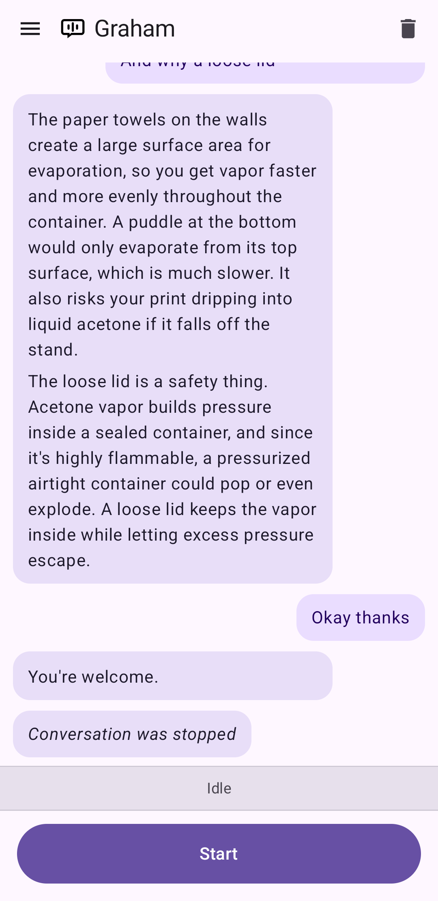

# Graham

Graham turns your Android phone into a fast, private voice interface for
whatever backend you want to talk to. You speak naturally, Graham transcribes
your words on-device with Parakeet, sends the transcript to your server, and
answers out loud with Piper TTS. The heavy lifting stays on the phone; only the
final chat request leaves the device.



## Why Graham

Graham is built for people who want the convenience of a voice assistant without
giving up control over where their data goes.

- **Feels conversational, not push-to-talk clunky**: speech detection listens
  for when you are done, sends the turn automatically, speaks the reply, and
  drops straight back into listening for the next one.
- **Keeps more of your data local**: speech recognition and text-to-speech run
  on-device, so your raw audio does not need to be shipped off for basic voice
  handling.
- **Fits your backend instead of forcing theirs**: point Graham at any HTTP
  endpoint, shape the request body with a template, and even use URL-embedded
  basic auth when needed.
- **Made for real use, not just demos**: it can keep a conversation alive while
  you switch apps, pauses other media while talking, and resumes playback when
  you are done.
- **Actually pleasant to use**: live waveform feedback, adjustable TTS speed,
  optional tones, Markdown-rendered replies, and built-in model status screens
  make it feel polished instead of experimental.

## How it works

1. Press **Start** to begin a conversation.
2. Speak naturally. Silero VAD detects when you stop talking.
3. Your speech is transcribed by Parakeet TDT-CTC 110M via sherpa-onnx.
4. The transcript is POSTed to your configured server URL.
5. The server's response is spoken back with Piper TTS.
6. The app listens again automatically for your next turn.
7. Press **Stop** to end the conversation.

Replies can be plain text or JSON with a `response` field. Bot responses are
rendered with Markdown in the conversation view, then spoken back as natural
speech.

The app pauses other media when a conversation starts and resumes it when you
stop. A foreground service keeps the microphone active if you switch to another
app mid-conversation.

## Setup

### Model files

Model files are not included in the repository. Run the download script before
building:

```sh
./download-models.sh
```

This downloads Parakeet TDT-CTC 110M, Silero VAD, Piper TTS, and the sherpa-onnx
AAR.

### Configuration

In the app, open the drawer and tap **Settings** to configure:

- **Server URL**: The HTTP endpoint that receives transcripts.
- **Body template**: The JSON body sent to the server. Use `$transcript` as a
  placeholder for the transcribed text.
- **TTS speed**: Tune the speaking rate to feel more natural for your use case.
- **Tones**: Enable or disable the app's audio cues.

The server should return a JSON object with a `response` field, or plain text.

There are also built-in **About** and **Model status** screens so you can verify
the speech and TTS assets are installed correctly.

### Building

```sh
./gradlew assembleDebug
./gradlew installDebug
```

## Stack

- Kotlin, Jetpack Compose, Material 3
- sherpa-onnx for both STT (Parakeet TDT-CTC 110M) and TTS (Piper)
- Silero VAD for speech boundary detection
- OkHttp for the chat backend
